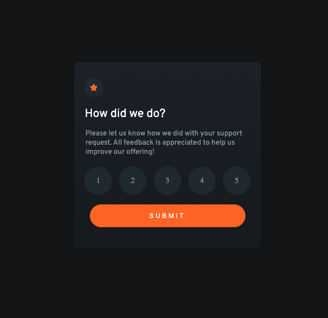
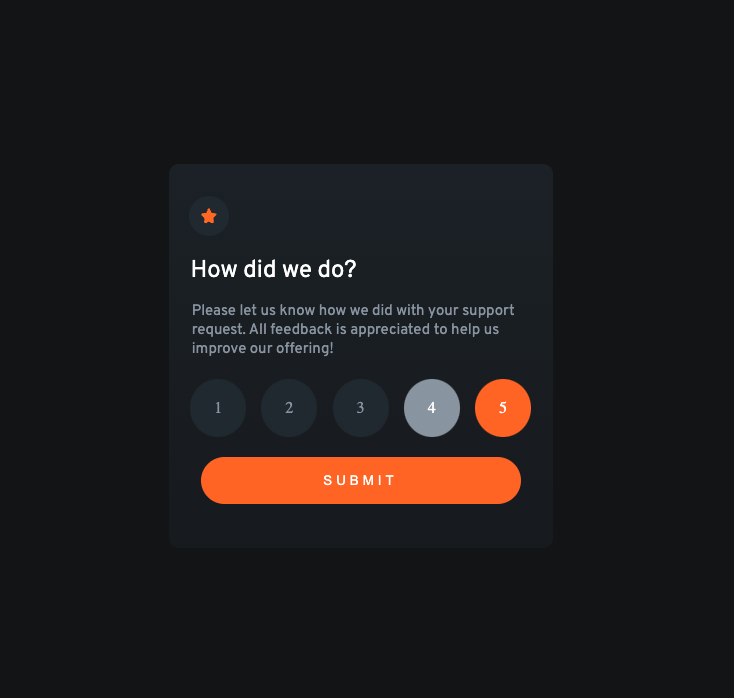
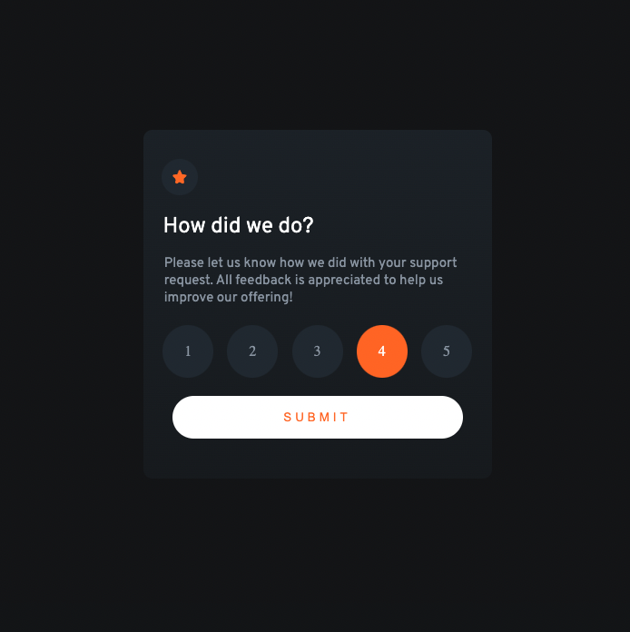

# Frontend Mentor - Interactive rating component solution

This is a solution to the [Interactive rating component challenge on Frontend Mentor](https://www.frontendmentor.io/challenges/interactive-rating-component-koxpeBUmI). Frontend Mentor challenges help you improve your coding skills by building realistic projects. 

## Table of contents

- [Overview](#overview)
  - [The challenge](#the-challenge)
  - [Screenshot](#screenshot)
- [My process](#my-process)
  - [Built with](#built-with)
  - [What I learned](#what-i-learned)
  - [Continued development](#continued-development)
  - [Useful resources](#useful-resources)
- [Author](#author)
- [Acknowledgments](#acknowledgments)

## Overview
I decided to tackle this Frontend Mentor project using HTML5, CSS and Javascript. I decided to keep all the elements on one page and change the display with JS to hide the first state and show the second state when the "Submit" button is clicked. Instead of opting for a second html page to display the results.

### The challenge

Users should be able to:

- View the optimal layout for the app depending on their device's screen size
- See hover states for all interactive elements on the page
- Select and submit a number rating
- See the "Thank you" card state after submitting a rating

### Screenshot

## My process
 
 I started with The HTML5, then the CSS then the Javascript. I found I ended up turning the CSS off and finishing the HTML and Javascript functionality before finalizing the CSS styles. In the future I think I will try functionality first.

### Built with

- Semantic HTML5 markup
- CSS custom properties
- Flexbox
- Vanilla Javascript
- Mobile first workflow

### What I learned

- HTML has a great deal of solutions that you can use before adding CSS and JS. 

-Forms can submit to the same page. 

### Continued development

I still need to learn more HTML elements. 

Build HTML and Javascript functionality first.

I tend to over engineer my Javascript and then find simple solutions online to fix my problems.

### Useful resources

- This page helped me fix my two click problem on the submit button - https://stackoverflow.com/questions/32299475/why-do-my-onclick-functions-take-two-clicks#:~:text=This%20is%20because%20you%20are,on%20click%20of%20your%20button.&text=Then%2C%20the%20second%20click%20works,now%20the%20code%20will%20run.

- This video helped me get my head around submitting forms and specifically submitting results to the same page - https://www.youtube.com/watch?v=fNcJuPIZ2WE&t=1046s

## Author

- Website - https://github.com/timbosTours
- Frontend Mentor - https://www.frontendmentor.io/profile/timbosTours
- Twitter - https://twitter.com/timbosTours

## Acknowledgments

Big thanks to Frontend Mentor and anyone who takes the time to review my code.
